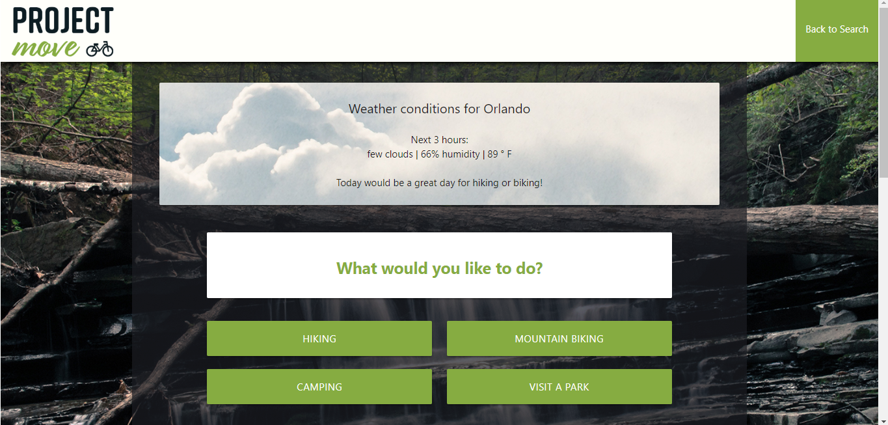
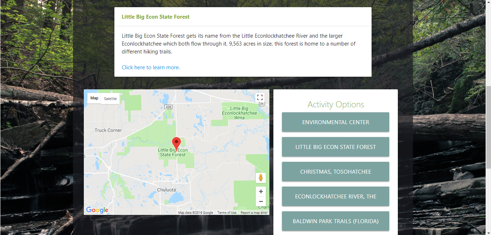

# Project_Move

Project Move is a client-side Javascript application. Its goal is to provide users with a way to search for outdoor activities in their city. The application pulls in weather data, Google maps data, and trail data to give users enough information to make a decision on an outdoor activity.

Project Move was created by a team of developers:
* [Victoria League](https://vleague2.github.io): project management, page layout, logo design, parks API
* [Carlos Bejar](https://github.com/cbejar93): trails API, client-side Javascript, Google maps API
* [Roshee Acevedo](https://github.com/rsami23): HTML and CSS design, mobile responsiveness
* [Hrag Mahserdjian](https://github.com/Hmahserdjian): client-side Javascript, background image photography

## Screenshots 

## Visit the site
[Project Move website](https://vleague2.github.io/project_move/)

## What the app does

* User can search for the city of their choice around the US
* Once search is completed, the weather of the city will be shown
* Based off the weather, activities will be recommended to the user
* User can choose from a list of activites
* A list of parks and trails for the city will populate 
* The places will show up on the map in pins 
* The user can use this data to help decide what they will like to do for the day!

## How we created the app

* Our team used a combination of JavaScript, jQuery, Materialize, FireBase, and a few APIs to create this app
* We created HTML for the main page and created a form for the user to input the city of their choice
* We used the Materialize framework to create the design for the site
* The screen with all the park info, map, and weather was dynamically created through JavaScript
* We created AJAX calls for our APIs: Google Places, Google Maps, Trail API, and Open Weather Map
* In the app, we collect the city the user inputs and generate the weather for that location from the Open Weather Weather API
* The app uses that data to then recommend the activities to the user
* Using Google Maps API, the app appends the map to the screen to show the area the user chose
* The app creates four button options based on activities from the Trail API and Google Places API
* When an activity button is clicked, the app uses the Trail API and Google Places API to generate a button list of parks and destinations for the city
* When the buttons are clicked, the app appends park data to the screen in a dynamically created div
* Lastly, we tested the site for mobile functionality and added media queries if needed

## Future Development

* Add support for more types of activities
* Add the option to specify the state of the city (a limitation in the API used)
* Add support for international cities
* Add support for night-time weather and activities
* Allow the user to load more activity destinations
* Populate the Google Map pin with more information about the location itself
* Add more specific weather-based activity recommendations
* Generate button options based on the weather
