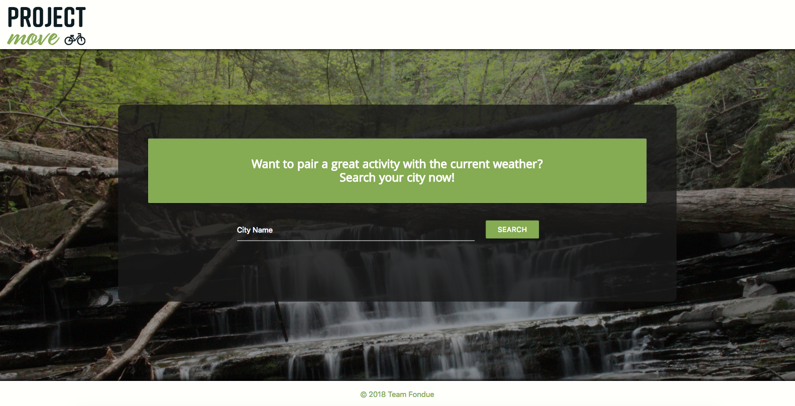

# Project_Move

* What the app does

1. User can search for the city of their choice around the US
2. Once search is completed, the weather of the city will be shown
3. Based off the weather, activities will be recommended to the user
4. User can choose from a list of activites
5. A list of parks and trails for the city will populate 
6. The places will show up on the map in pins 
7. The user can use this data to help decide what they will like to do for the day!

* How we created the app

1. Our team used a combination of JavaScript, jQuery, Materialize, FireBase, and a few APIs to create this app
2. We created HTML for the main page and created a form for the user to input the city of their choice
3. We used the Materialize framework to create the design for the site
4. The screen with all the park info, map, and weather was dynamically created through JavaScript
5. We created AJAX calls for our APIs: Google Places, Google Maps, Trail API, and Open Weather Map
6. In the app, we collect the city the user inputs and generate the weather for that location from the Open Weather Weather API
7. The app uses that data to then recommend the activities to the user
8. Using Google Maps API, the app appends the map to the screen to show the area the user chose
9. The app creates four button options based on activities from the Trail API and Google Places API
10. When an activity button is clicked, the app uses the Trail API and Google Places API to generate a button list of parks and destinations for the city
11. When the buttons are clicked, the app appends park data to the screen in a dynamically created div
12. Lastly, we tested the site for mobile functionality and added media queries if needed

* Future Development

1. Add support for more types of activities
2. Add the option to specify the state of the city (a limitation in the API used)
3. Add support for international cities
4. Add support for night-time weather and activities
5. Allow the user to load more activity destinations
6. Populate the Google Map pin with more information about the location itself
7. Add more specific weather-based activity recommendations
8. Generate button options based on the weather
